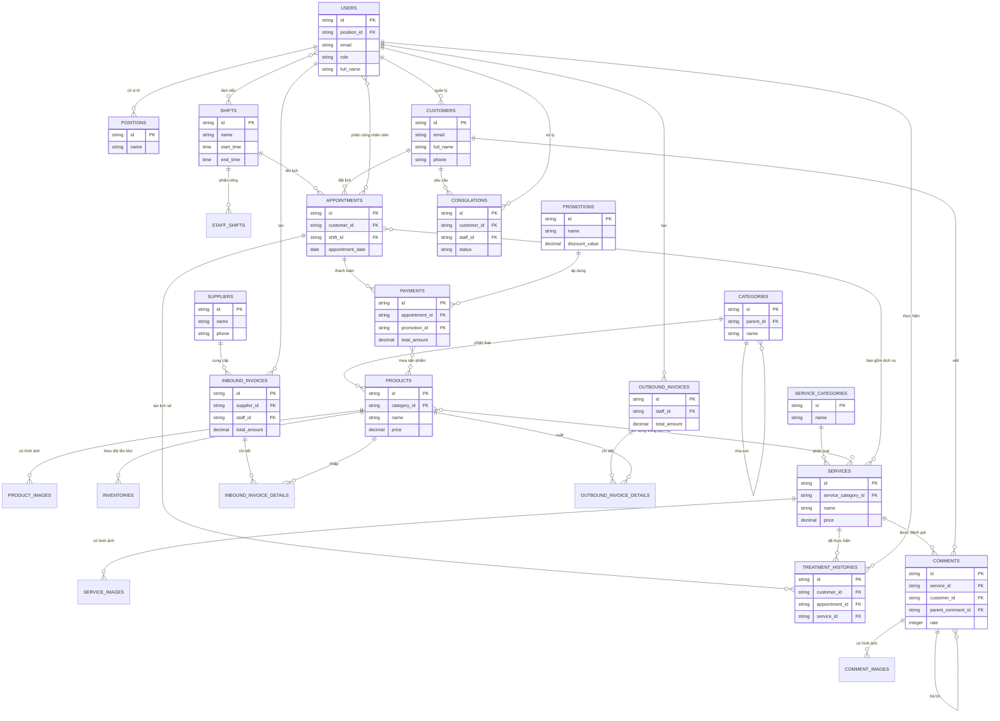

# 3.3.3.1. SƠ ĐỒ THỰC THỂ QUAN HỆ (ERD)

## 1. MÔ TẢ TỔNG QUAN       

Sơ đồ thực thể quan hệ (Entity Relationship Diagram) mô tả cấu trúc cơ sở dữ liệu của hệ thống quản lý dịch vụ SPA, bao gồm các bảng dữ liệu và mối quan hệ giữa chúng.

**Tổng số bảng**: 31 bảng  
**Số lượng quan hệ**: Nhiều quan hệ 1-1, 1-N, và N-N

---

## 2. ERD LEVEL 1 - SƠ ĐỒ TỔNG QUAN (CONCEPTUAL LEVEL)

ERD Level 1 là sơ đồ mức khái niệm, chỉ hiển thị các thực thể chính và quan hệ giữa chúng, không đi vào chi tiết thuộc tính.

### 2.1. Sơ đồ Mermaid ERD Level 1



### 2.2. Mô tả ERD Level 1

**Các thực thể chính:**
1. **USERS** (Nhân viên/Admin) - Trung tâm của hệ thống quản lý
2. **CUSTOMERS** (Khách hàng) - Khách hàng sử dụng dịch vụ
3. **PRODUCTS** (Sản phẩm) - Sản phẩm trong kho
4. **SERVICES** (Dịch vụ) - Dịch vụ spa
5. **APPOINTMENTS** (Cuộc hẹn) - Lịch hẹn khách hàng
6. **PAYMENTS** (Thanh toán) - Thanh toán dịch vụ/sản phẩm
7. **CONSULATIONS** (Tư vấn) - Tư vấn khách hàng
8. **TREATMENT_HISTORIES** (Lịch sử điều trị) - Theo dõi điều trị
9. **COMMENTS** (Bình luận) - Đánh giá dịch vụ
10. **INBOUND_INVOICES / OUTBOUND_INVOICES** (Hóa đơn nhập/xuất)

**Quan hệ chính:**
- USERS quản lý CUSTOMERS, tạo APPOINTMENTS, xử lý CONSULATIONS
- CUSTOMERS đặt APPOINTMENTS, yêu cầu CONSULATIONS, viết COMMENTS
- APPOINTMENTS liên kết với SERVICES, USERS (nhân viên), và tạo PAYMENTS
- PRODUCTS được sử dụng trong SERVICES và bán qua PAYMENTS
- Hóa đơn quản lý nhập/xuất sản phẩm

---

## 3. ERD LEVEL 2 - SƠ ĐỒ CHI TIẾT (LOGICAL LEVEL)

ERD Level 2 là sơ đồ mức logic, hiển thị đầy đủ các thuộc tính chính của từng thực thể và các quan hệ chi tiết.

### 3.1. Sơ đồ Mermaid ERD Level 2

```mermaid
erDiagram
    %% QUẢN LÝ NGƯỜI DÙNG
    POSITIONS ||--o{ USERS : "1:N position_id"
    USERS ||--o{ USERS : "1:N created_by, updated_by"
    USERS ||--o{ CUSTOMERS : "1:N created_by, updated_by"
    
    %% QUẢN LÝ SẢN PHẨM
    CATEGORIES ||--o{ CATEGORIES : "1:N parent_id"
    CATEGORIES ||--o{ PRODUCTS : "1:N category_id"
    PRODUCTS ||--o{ PRODUCT_IMAGES : "1:N product_id"
    PRODUCTS ||--o{ INVENTORIES : "1:N product_id"
    PRODUCTS }o--o{ SERVICES : "N:M product_services"
    
    %% QUẢN LÝ DỊCH VỤ
    SERVICE_CATEGORIES ||--o{ SERVICES : "1:N service_category_id"
    SERVICES ||--o{ SERVICE_IMAGES : "1:N service_id"
    SERVICES ||--o{ COMMENTS : "1:N service_id"
    SERVICES ||--o{ TREATMENT_HISTORIES : "1:N service_id"
    
    %% QUẢN LÝ CA LÀM VIỆC
    SHIFTS ||--o{ APPOINTMENTS : "1:N shift_id"
    USERS }o--o{ SHIFTS : "N:M staff_shifts"
    SHIFTS ||--o{ STAFF_SHIFTS : "1:N shift_id"
    
    %% QUẢN LÝ CUỘC HẸN
    CUSTOMERS ||--o{ APPOINTMENTS : "1:N customer_id"
    USERS ||--o{ APPOINTMENTS : "1:N created_by, updated_by"
    APPOINTMENTS }o--o{ SERVICES : "N:M appointment_services"
    APPOINTMENTS }o--o{ USERS : "N:M appointment_staffs"
    APPOINTMENTS ||--o{ PAYMENTS : "1:N appointment_id"
    APPOINTMENTS ||--o{ TREATMENT_HISTORIES : "1:N appointment_id"
    APPOINTMENTS ||--o{ COMMENTS : "1:N appointment_id"
    
    %% QUẢN LÝ THANH TOÁN
    PROMOTIONS ||--o{ PAYMENTS : "1:N promotion_id"
    USERS ||--o{ PAYMENTS : "1:N created_by"
    PAYMENTS }o--o{ PRODUCTS : "N:M payment_products"
    
    %% QUẢN LÝ TƯ VẤN
    CUSTOMERS ||--o{ CONSULATIONS : "1:N customer_id"
    USERS ||--o{ CONSULATIONS : "1:N staff_id, created_by, updated_by"
    
    %% QUẢN LÝ BÌNH LUẬN
    CUSTOMERS ||--o{ COMMENTS : "1:N customer_id"
    COMMENTS ||--o{ COMMENTS : "1:N parent_comment_id"
    COMMENTS ||--o{ COMMENT_IMAGES : "1:N comment_id"
    USERS ||--o{ COMMENTS : "1:N created_by, updated_by"
    
    %% QUẢN LÝ LỊCH SỬ ĐIỀU TRỊ
    CUSTOMERS ||--o{ TREATMENT_HISTORIES : "1:N customer_id"
    USERS ||--o{ TREATMENT_HISTORIES : "1:N staff_id, created_by, updated_by"
    
    %% QUẢN LÝ HÓA ĐƠN
    SUPPLIERS ||--o{ INBOUND_INVOICES : "1:N supplier_id"
    USERS ||--o{ INBOUND_INVOICES : "1:N staff_id, created_by, updated_by"
    INBOUND_INVOICES ||--o{ INBOUND_INVOICE_DETAILS : "1:N inbound_invoice_id"
    PRODUCTS ||--o{ INBOUND_INVOICE_DETAILS : "1:N product_id"
    USERS ||--o{ OUTBOUND_INVOICES : "1:N staff_id, created_by, updated_by"
    OUTBOUND_INVOICES ||--o{ OUTBOUND_INVOICE_DETAILS : "1:N outbound_invoice_id"
    PRODUCTS ||--o{ OUTBOUND_INVOICE_DETAILS : "1:N product_id"
    
    %% BẢNG TRUNG GIAN N-N
    PRODUCT_SERVICES {
        string id PK
        string product_id FK
        string service_id FK
        integer quantity_used
    }
    
    STAFF_SHIFTS {
        string id PK
        string staff_id FK
        string shift_id FK
    }
    
    APPOINTMENT_STAFFS {
        string id PK
        string appointment_id FK
        string staff_id FK
    }
    
    APPOINTMENT_SERVICES {
        string id PK
        string appointment_id FK
        string service_id FK
        integer quantity
        decimal price
    }
    
    PAYMENT_PRODUCTS {
        string id PK
        string payment_id FK
        string product_id FK
        integer quantity
        decimal unit_price
        decimal total_price
    }
    
    %% THỰC THỂ CHÍNH - CHI TIẾT THUỘC TÍNH
    USERS {
        string id PK
        string position_id FK
        string email UK
        string password
        tinyint role
        string full_name
        tinyint gender
        string phone UK
        string address
        date date_of_birth
        string note
        boolean status
        string created_by FK
        string updated_by FK
        timestamp email_verified_at
        timestamp deleted_at
        timestamp created_at
        timestamp updated_at
    }
    
    CUSTOMERS {
        string id PK
        string email UK
        string password
        string full_name
        tinyint gender
        string phone
        string address
        date date_of_birth
        string note
        boolean status
        string created_by FK
        string updated_by FK
        timestamp email_verified_at
        timestamp deleted_at
        timestamp created_at
        timestamp updated_at
    }
    
    POSITIONS {
        string id PK
        string name
        string description
        boolean status
        string created_by FK
        string updated_by FK
        timestamp deleted_at
        timestamp created_at
        timestamp updated_at
    }
    
    CATEGORIES {
        string id PK
        string parent_id FK
        string name
        string description
        boolean status
        string created_by FK
        string updated_by FK
        timestamp deleted_at
        timestamp created_at
        timestamp updated_at
    }
    
    PRODUCTS {
        string id PK
        string category_id FK
        string name
        decimal price
        decimal cost
        string capacity
        string bar_code
        date date
        string image_url
        integer priority
        string description
        boolean status
        string created_by FK
        string updated_by FK
        timestamp deleted_at
        timestamp created_at
        timestamp updated_at
    }
    
    PRODUCT_IMAGES {
        string id PK
        string product_id FK
        string image_url
        string created_by FK
        string updated_by FK
        timestamp deleted_at
        timestamp created_at
        timestamp updated_at
    }
    
    INVENTORIES {
        string id PK
        string product_id FK
        integer quantity
        string created_by FK
        string updated_by FK
        timestamp deleted_at
        timestamp created_at
        timestamp updated_at
    }
    
    SERVICE_CATEGORIES {
        string id PK
        string name
        string description
        string image_url
        boolean status
        string created_by FK
        string updated_by FK
        timestamp deleted_at
        timestamp created_at
        timestamp updated_at
    }
    
    SERVICES {
        string id PK
        string service_category_id FK
        string name
        decimal price
        string description
        string image_url
        integer duration
        integer priority
        boolean status
        string created_by FK
        string updated_by FK
        timestamp deleted_at
        timestamp created_at
        timestamp updated_at
    }
    
    SERVICE_IMAGES {
        string id PK
        string service_id FK
        string image_url
        string created_by FK
        string updated_by FK
        timestamp deleted_at
        timestamp created_at
        timestamp updated_at
    }
    
    SHIFTS {
        string id PK
        string name
        time start_time
        time end_time
        string description
        boolean status
        string created_by FK
        string updated_by FK
        timestamp deleted_at
        timestamp created_at
        timestamp updated_at
    }
    
    APPOINTMENTS {
        string id PK
        string shift_id FK
        string customer_id FK
        time start_time
        date appointment_date
        string note
        tinyint status
        string created_by FK
        string updated_by FK
        timestamp deleted_at
        timestamp created_at
        timestamp updated_at
    }
    
    PROMOTIONS {
        string id PK
        string name
        string description
        string image_url
        string discount_type
        decimal discount_value
        date start_date
        date end_date
        boolean status
        string created_by FK
        string updated_by FK
        timestamp deleted_at
        timestamp created_at
        timestamp updated_at
    }
    
    PAYMENTS {
        string id PK
        string appointment_id FK
        string promotion_id FK
        decimal service_total
        decimal product_total
        decimal subtotal
        decimal reduce
        decimal total_amount
        boolean payment_type
        boolean status
        string created_by FK
        timestamp created_at
        timestamp updated_at
    }
    
    CONSULATIONS {
        string id PK
        string customer_id FK
        string staff_id FK
        string consulation
        string skin_condition
        string treatment_plan
        boolean status
        string created_by FK
        string updated_by FK
        timestamp deleted_at
        timestamp created_at
        timestamp updated_at
    }
    
    TREATMENT_HISTORIES {
        string id PK
        string customer_id FK
        string appointment_id FK
        string staff_id FK
        string service_id FK
        string image_before
        string image_after
        string feedback
        string note
        boolean status
        tinyint evaluete
        string created_by FK
        string updated_by FK
        timestamp deleted_at
        timestamp created_at
        timestamp updated_at
    }
    
    COMMENTS {
        string id PK
        string service_id FK
        string customer_id FK
        string parent_comment_id FK
        string appointment_id FK
        string comment
        integer rate
        boolean status
        boolean type
        string created_by FK
        string updated_by FK
        timestamp deleted_at
        timestamp created_at
        timestamp updated_at
    }
    
    COMMENT_IMAGES {
        string id PK
        string comment_id FK
        string image_url
        string created_by FK
        string updated_by FK
        timestamp deleted_at
        timestamp created_at
        timestamp updated_at
    }
    
    SUPPLIERS {
        string id PK
        string name
        string phone
        string email
        string address
        string note
        boolean status
        string created_by FK
        string updated_by FK
        timestamp deleted_at
        timestamp created_at
        timestamp updated_at
    }
    
    INBOUND_INVOICES {
        string id PK
        string staff_id FK
        string supplier_id FK
        string note
        decimal total_amount
        boolean status
        string created_by FK
        string updated_by FK
        timestamp deleted_at
        timestamp created_at
        timestamp updated_at
    }
    
    INBOUND_INVOICE_DETAILS {
        string id PK
        string inbound_invoice_id FK
        string product_id FK
        integer quantity
        decimal unit_price
        decimal total_price
        timestamp created_at
        timestamp updated_at
    }
    
    OUTBOUND_INVOICES {
        string id PK
        string staff_id FK
        string note
        enum outbound_invoice_type
        decimal total_amount
        boolean status
        string created_by FK
        string updated_by FK
        timestamp deleted_at
        timestamp created_at
        timestamp updated_at
    }
    
    OUTBOUND_INVOICE_DETAILS {
        string id PK
        string outbound_invoice_id FK
        string product_id FK
        integer quantity
        decimal unit_price
        decimal total_price
        timestamp created_at
        timestamp updated_at
    }
    
    CONTACTS {
        string id PK
        string name
        string email
        string phone
        string message
        boolean status
        timestamp created_at
        timestamp updated_at
    }
    
    NOTIFICATIONS {
        string id PK
        string user_id FK
        string title
        string content
        string type
        boolean status
        timestamp read_at
        timestamp created_at
        timestamp updated_at
    }
```



### 3.2. Mô tả ERD Level 2

**Đặc điểm của ERD Level 2:**
1. **Hiển thị đầy đủ thuộc tính** của mỗi thực thể
2. **Các khóa chính (PK)** và **khóa ngoại (FK)** được đánh dấu rõ ràng
3. **Các ràng buộc** như UNIQUE (UK) được chỉ định
4. **Kiểu dữ liệu** được mô tả (string, decimal, integer, boolean, date, timestamp)
5. **Các bảng trung gian** cho quan hệ N-N được hiển thị đầy đủ
6. **Soft delete** (`deleted_at`) và **audit trail** (`created_by`, `updated_by`) được thể hiện

**So sánh Level 1 và Level 2:**
- **Level 1**: Tập trung vào các thực thể chính và quan hệ, dễ hiểu tổng quan
- **Level 2**: Chi tiết đầy đủ về cấu trúc dữ liệu, phù hợp cho việc triển khai

---

## 4. BẢNG TỔNG HỢP QUAN HỆ

### 4.1. Quan hệ 1-N (One-to-Many)

| Thực thể 1 | Thực thể N | Foreign Key | Mô tả |
|------------|------------|-------------|-------|
| POSITIONS | USERS | position_id | Vị trí có nhiều nhân viên |
| CATEGORIES | PRODUCTS | category_id | Danh mục chứa nhiều sản phẩm |
| CATEGORIES | CATEGORIES | parent_id | Danh mục cha-con |
| PRODUCTS | PRODUCT_IMAGES | product_id | Sản phẩm có nhiều hình ảnh |
| PRODUCTS | INVENTORIES | product_id | Sản phẩm có nhiều bản ghi tồn kho |
| SERVICE_CATEGORIES | SERVICES | service_category_id | Danh mục dịch vụ chứa nhiều dịch vụ |
| SERVICES | SERVICE_IMAGES | service_id | Dịch vụ có nhiều hình ảnh |
| SHIFTS | APPOINTMENTS | shift_id | Ca làm việc có nhiều cuộc hẹn |
| CUSTOMERS | APPOINTMENTS | customer_id | Khách hàng có nhiều cuộc hẹn |
| APPOINTMENTS | PAYMENTS | appointment_id | Cuộc hẹn có thể có nhiều thanh toán |
| PROMOTIONS | PAYMENTS | promotion_id | Khuyến mãi áp dụng cho nhiều thanh toán |
| CUSTOMERS | CONSULATIONS | customer_id | Khách hàng có nhiều yêu cầu tư vấn |
| USERS | CONSULATIONS | staff_id | Nhân viên xử lý nhiều tư vấn |
| SERVICES | COMMENTS | service_id | Dịch vụ có nhiều bình luận |
| CUSTOMERS | COMMENTS | customer_id | Khách hàng viết nhiều bình luận |
| COMMENTS | COMMENTS | parent_comment_id | Bình luận có thể reply |

### 4.2. Quan hệ N-N (Many-to-Many)

| Thực thể 1 | Thực thể 2 | Bảng trung gian | Mô tả |
|------------|------------|-----------------|-------|
| PRODUCTS | SERVICES | product_services | Sản phẩm sử dụng trong nhiều dịch vụ |
| USERS | SHIFTS | staff_shifts | Nhân viên làm việc nhiều ca |
| APPOINTMENTS | USERS | appointment_staffs | Cuộc hẹn phân công nhiều nhân viên |
| APPOINTMENTS | SERVICES | appointment_services | Cuộc hẹn bao gồm nhiều dịch vụ |
| PAYMENTS | PRODUCTS | payment_products | Thanh toán mua nhiều sản phẩm |

---

## 5. GHI CHÚ QUAN TRỌNG

### 5.1. Khóa chính (Primary Keys)
- Tất cả bảng sử dụng **Snowflake ID** (string, 20 ký tự) làm khóa chính
- Không sử dụng auto-increment integer

### 5.2. Khóa ngoại (Foreign Keys)
- Hầu hết foreign keys có `onDelete('set null')` để bảo toàn dữ liệu
- Self-referencing: `users` (created_by, updated_by), `categories` (parent_id), `comments` (parent_comment_id)

### 5.3. Soft Delete
- Hầu hết bảng có trường `deleted_at` (timestamp nullable)
- Cho phép khôi phục dữ liệu và giữ tính toàn vẹn

### 5.4. Audit Trail
- Các bảng chính có `created_by`, `updated_by` (FK → users)
- `created_at`, `updated_at` tự động cập nhật

### 5.5. Status Fields
- Nhiều bảng có trường `status` (boolean) để quản lý active/inactive
- Mặc định thường là `true` (active)

---

## 6. LUỒNG DỮ LIỆU CHÍNH

### 6.1. Luồng Đặt Lịch Hẹn
```
CUSTOMERS → APPOINTMENTS → (SERVICES, USERS) → PAYMENTS → (PROMOTIONS, PRODUCTS)
```

### 6.2. Luồng Quản Lý Tồn Kho
```
SUPPLIERS → INBOUND_INVOICES → INBOUND_INVOICE_DETAILS → PRODUCTS → INVENTORIES
PRODUCTS → OUTBOUND_INVOICES → OUTBOUND_INVOICE_DETAILS → INVENTORIES (giảm)
```

### 6.3. Luồng Dịch Vụ và Sản Phẩm
```
SERVICES ↔ PRODUCTS (product_services) → INVENTORIES (giảm khi sử dụng)
```

### 6.4. Luồng Đánh Giá
```
CUSTOMERS → APPOINTMENTS → SERVICES → COMMENTS → COMMENT_IMAGES
```

---

**Tài liệu này cung cấp sơ đồ ERD ở 2 mức: Level 1 (tổng quan) và Level 2 (chi tiết) để phục vụ việc hiểu và triển khai hệ thống.**

